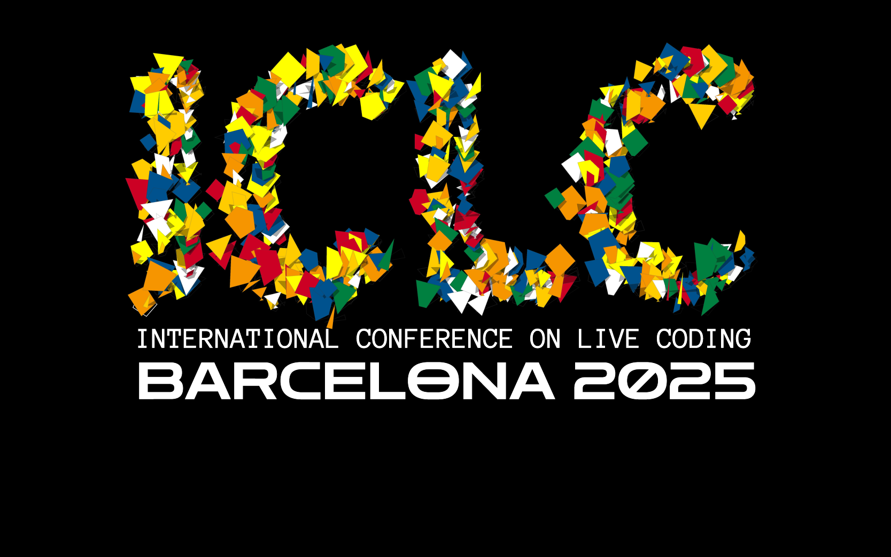
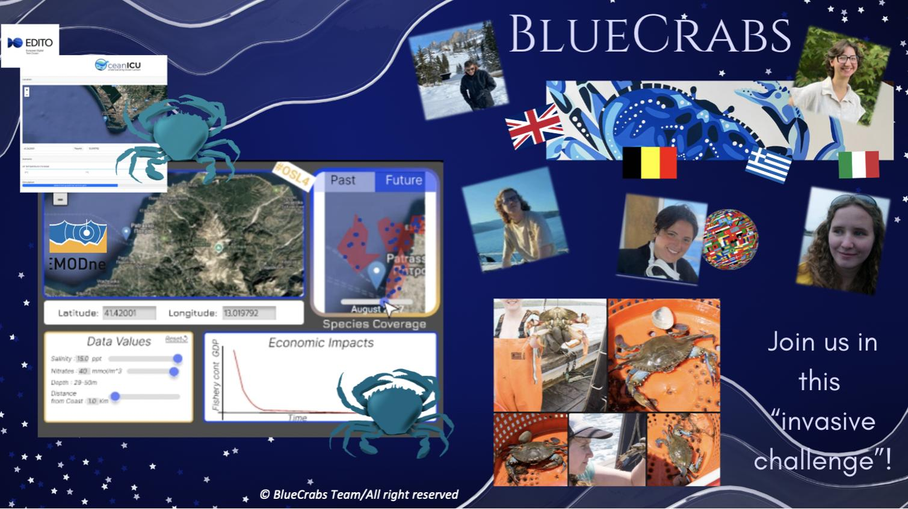

[[about]] | [[publications]] | [[people]] 

## Latest News

|                                                                                                                              |                                                                                                                                                                                                                                                                                      |
| ---------------------------------------------------------------------------------------------------------------------------- | ------------------------------------------------------------------------------------------------------------------------------------------------------------------------------------------------------------------------------------------------------------------------------------ |
|                                                                        | [[Dr Anna Xambó - keynote, paper and performance at ICLC2025]] Anna Xambó will be giving a keynote on Wednesday 28 May 16:30-17:30 on "Liveness as an open work: an ongoing live-coding algorithmic journey" at the International Conference on Live Coding (ICLC).                  |
|                                                                                   | [[BSc student Stanley Parker wins a hackathon]] Stanley Parker, a third-year BSc Creative Computing student at the School of Electronic Engineering and Computer Science, recently took part in Open Sea Lab 4.0, a prestigious international hackathon focused on ocean innovation. |
|  | [[PhD position available at the lab]] An exciting PhD position to work on “Nature-inspired computing for sound-based DIY approaches to creative AI” at the Centre for Digital Music, School of Electronic Engineering and Computer Science, Queen Mary University of London.         |
