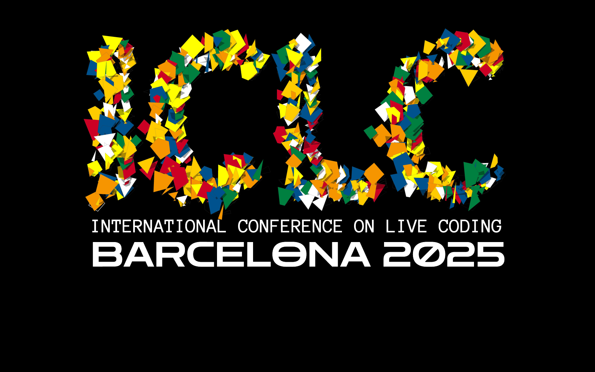

# Computational Sonic Arts Laboratory

> The lab aims to become a research hub in developing sustainable, inclusive, and forward-thinking technologies that transform how we create, experience, and understand music.

The Computational Sonic Arts Laboratory is a research team based in the [Centre for Digital Music](https://www.c4dm.eecs.qmul.ac.uk/) (C4DM) at Queen Mary University of London dedicated to advancing the intersection of sonic arts and cutting-edge technology. The lab is led by [Dr Anna Xambó Sedó](https://www.c4dm.eecs.qmul.ac.uk/) and has been founded in 2025 as part of QMUL's Centre for Digital Music. 

Rooted in principles of **culture**, **creativity**, and **community**, the lab explores **sonic creativities** and **creative computing** through innovative research in **creative AI**, **music AI**, and **intelligent music systems**. The vision of the lab is to bridge **HCI**, **sound and music computing**, and **new interfaces for musical expression**, by emphasising **live coding**, **network music**, and **generative sound-based music**. The lab aims to become a research hub in developing sustainable, inclusive, and forward-thinking technologies that transform how we create, experience, and understand music.

**Research activities include:**

* The design, deployment and evaluation of intelligent sound-based music systems that keep the human in the loop and give ownership to communities of practice and perspectives generally underrepresented in music AI. 
* The creation of sound-based music performances and sonic arts experiences that foster democratic principles in music making and raise awareness of real-world problems.
* The design and development of sustainable and DIY systems based on interdisciplinary methods involving art, science and engineering and in alignment with open source, open hardware, citizen science and the [Maker's Bill of Rights](https://makezine.com/article/maker-news/the-makers-bill-of-rights/). 

The lab hosts the AHRC-funded project [Sensing the Forest - Let the Forest Speak using the Internet of Things, Acoustic Ecology and Creative AI](https://sensingtheforest.github.io/), which pursues raising awareness and understanding of forest environmental data and how they relate to climate change.

Please, get in touch if you are interested in PhD opportunities. The Centre for Digital Music of Queen Mary University of London [welcomes PhD applications for 2025](https://www.c4dm.eecs.qmul.ac.uk/get-involved/). 

## News

### May 2025

#### Dr Anna Xambó - keynote, paper and performance at ICLC2025

*ICLC 2025 logo*

CSAL's Anna Xambó will be giving a keynote on Wednesday 28 May 16:30-17:30 on "Liveness as an open work: an ongoing live-coding algorithmic journey" at the International Conference on Live Coding (ICLC).

On Thursday 29 May she will also deliver the paper co-authored paper ["Building a Dataset of Personal Live Coding Style Using MIRLCaProxy - A Journal of Creative Sonic Exploration under Constraints and Biases"](https://iclc.toplap.org/2025/catalogue/paper/building-a-dataset-of-personal-live-coding-style-using-a-journal.html) and will perform in the evening the live-coding session ["Sensing the Alice Holt Forest"](https://iclc.toplap.org/2025/catalogue/performance/sensing-the-alice-holt-forest.html).

For more info visit: [https://iclc.toplap.org/2025/](https://iclc.toplap.org/2025/)

#### BSc student Stanley Parker wins a hackathon

*BlueCrabs team at the Open Sea Lab 4.0 Hackathon*

[Crab Alert: Hackathon team builds award-winning early warning system for invasive species.](https://www.qmul.ac.uk/eecs/news-and-events/news/items/crab-alert-hackathon-team-builds-award-winning-early-warning-system-for-invasive-species.html)
Stanley Parker, a third-year BSc Creative Computing student at the School of Electronic Engineering and Computer Science, recently took part in Open Sea Lab 4.0, a prestigious international hackathon focused on ocean innovation.

### Feb 2025

#### PhD position available at the lab

*Image generated using [Craiyon AI](https://www.craiyon.com)*

We are happy to announce an exciting PhD position to work on **“Nature-inspired computing for sound-based DIY approaches to creative AI”** at the Centre for Digital Music, School of Electronic Engineering and Computer Science, Queen Mary University of London. 

* Application deadline: **28th February 2025**
* Requirements: **UK home student**
* How to apply: **[https://www.qmul.ac.uk/eecs/phd/how-to-apply/](https://www.qmul.ac.uk/eecs/phd/how-to-apply/)**
* You can find more info here: **[https://www.findaphd.com/phds/project/nature-inspired-computing-for-sound-based-diy-approaches-to-creative-ai/?p182149](https://www.findaphd.com/phds/project/nature-inspired-computing-for-sound-based-diy-approaches-to-creative-ai/?p182149)**

## Team

* [Dr Anna Xambó](https://annaxambo.me/) (Senior Lecturer in Sound and Music Computing, Queen Mary University of London)
* [Dr Luigi Marino](http://www.luigimarino.net/) (Research Fellow in Sound and Music Computing, Queen Mary University of London)
* [Shuoyang Zheng](https://jasperzheng.cc/) (PhD student, AIM/C4DM, Queen Mary University of London)
* [Qiaoxi Zhang](https://uk.linkedin.com/in/qiaoxi-z-2a2b39137) (PhD student, AIM/C4DM, Queen Mary University of London)
* Xinyue Xu (MSc Sound and Music Computing, Queen Mary University of London)
* [Andrés Sánchez Castrillón](https://www.linkedin.com/in/andres-sanchez-59a8331a6/) (MSc Artificial Intelligence, Queen Mary University of London)
* [Tug O’Flaherty](https://tugoflaherty.com/) (MSc Sound and Music Computing, Queen Mary University of London)
* James Shortland (MSc Data Science and Artificial Intelligence, Queen Mary University of London)
* [Aleksander Skutnik](https://www.linkedin.com/in/aleksander-skutnik-1a05a625a/) (BSc Computer Science, Queen Mary University of London)
* [Stanley Parker](https://www.linkedin.com/in/stanley-parker-43113425a) (BSc Creative Computing, Queen Mary University of London)
* Ning Liu (BSc(Eng)FT Electronic Engineering, Queen Mary University of London)
* Amrina Kaur Virk (BSc Creative Computing, Queen Mary University of London)

## Publications

* Xambó, A., Roma, G. (2025 forthcoming) Building a Dataset of Personal Live Coding Style Using MIRLCaProxy - A Journal of Creative Sonic Exploration under Constraints and Biases. *Proceedings of the International Conference of Live Coding*.
* O’Flaherty, T. F., Marino, L., Saitis, C., Xambó, A. (2025 forthcoming) Sonicolour: Exploring Colour Control of Sound Synthesis with Interactive Machine Learning. *Proceedings of the New Interfaces for Musical Expression*.
* Xambó, A. (2025) [Live Coding a Chorale of Sounds Using MIRLCa: State of Affairs and Implications](https://zenodo.org/records/15283062). *SuperCollider Symposium 2025*, Johns Hopkins University Bloomberg Center, Washington D.C., USA. [https://doi.org/10.5281/zenodo.15283062](https://doi.org/10.5281/zenodo.15283062) 
* Xambó, A., Roma, G. (2024) [Human–machine agencies in live coding for music performance](https://www.tandfonline.com/doi/full/10.1080/09298215.2024.2442355). *Journal of New Music Research*, 53(1–2), 33–46. [https://doi.org/10.1080/09298215.2024.2442355](https://doi.org/10.1080/09298215.2024.2442355).
* Marino, L., Xambó, A. (2024) [Developing DIY solar-powered, off-grid audio streamers for forest soundscapes: progress and challenges](https://static1.squarespace.com/static/6227c31a43daf21135453605/t/673e659f730d2433d5916462/1732142495610/21+Luigi+Marino+and+Anna+Xambo%CC%81.pdf). *Proceedings of CHIME Annual Conference*, The Open University, 1-2 December 2024.
