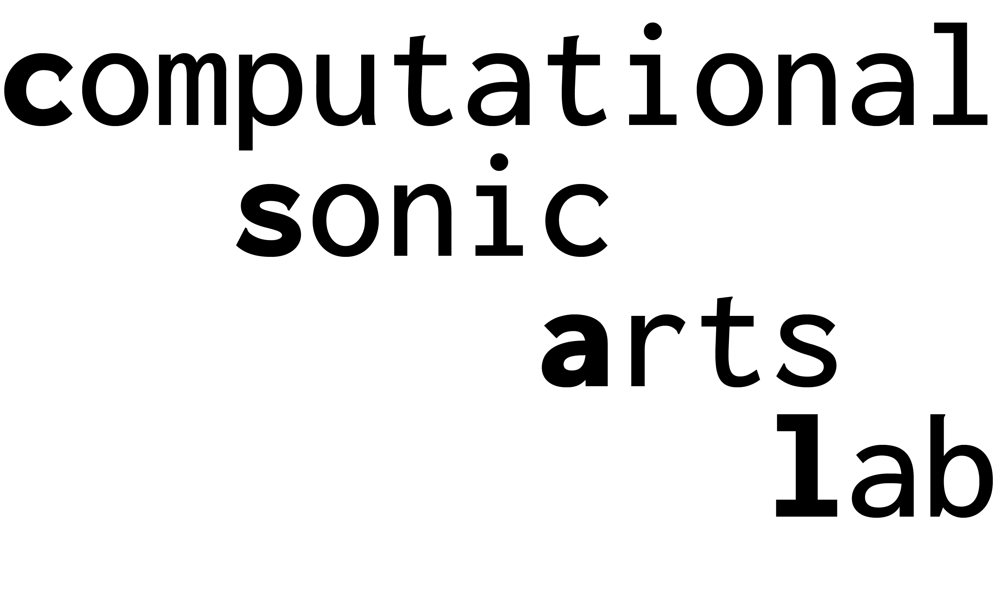

# Computational Sonic Arts Laboratory

The Computational Sonic Arts Laboratory is a research team based in the [Centre for Digital Music](https://www.c4dm.eecs.qmul.ac.uk/) (C4DM) at Queen Mary University of London dedicated to advancing the intersection of sonic arts and cutting-edge technology. The lab is led by [Dr Anna Xambó Sedó](https://www.c4dm.eecs.qmul.ac.uk/) and has been founded in 2025 as part of QMUL's Centre for Digital Music. 

Rooted in principles of culture, creativity, and community, the lab explores sonic creativities and creative computing through innovative research in creative AI, music AI, and intelligent music systems. The vision of the lab is to bridge HCI, sound and music computing, and new interfaces for musical expression, by emphasising live coding, network music, and generative sound-based music. The lab aims to become a research hub in developing sustainable, inclusive, and forward-thinking technologies that transform how we create, experience, and understand music.

Research activities include:

* The design, deployment and evaluation of intelligent sound-based music systems that keep the human in the loop and give ownership to communities of practice and perspectives generally underrepresented in music AI. 
* The creation of sound-based music performances and sonic arts experiences that foster democratic principles in music making and raise awareness of real-world problems.
* The design and development of sustainable and DIY systems based on interdisciplinary methods involving art, science and engineering and in alignment with open source, open hardware, citizen science and the [Maker's Bill of Rights](https://makezine.com/article/maker-news/the-makers-bill-of-rights/). 

The lab hosts the AHRC-funded project [Sensing the Forest - Let the Forest Speak using the Internet of Things, Acoustic Ecology and Creative AI](https://sensingtheforest.github.io/), which pursues raising awareness and understanding of forest environmental data and how they relate to climate change.

Please, get in touch if you are interested in PhD opportunities. The Centre for Digital Music of Queen Mary University of London [welcomes PhD applications for 2025](https://www.c4dm.eecs.qmul.ac.uk/get-involved/). 

## Team

* [Dr Anna Xambó](https://annaxambo.me/) (Senior Lecturer in Sound and Music Computing, Queen Mary University of London)
* [Dr Luigi Marino](http://www.luigimarino.net/) (Research Fellow in Sound and Music Computing, Queen Mary University of London)
* [Shuoyang Zheng](https://jasperzheng.cc/) (PhD student, Queen Mary University of London)
* Xinyue Xu (MSc Sound and Music Computing, Queen Mary University of London)
* [Andrés Sánchez Castrillón](https://www.linkedin.com/in/andres-sanchez-59a8331a6/) (MSc Artificial Intelligence, Queen Mary University of London)
* [Tug O’Flaherty](https://tugoflaherty.com/) (MSc Sound and Music Computing, Queen Mary University of London)
* James Shortland (MSc Data Science and Artificial Intelligence)
* [Aleksander Skutnik](https://www.linkedin.com/in/aleksander-skutnik-1a05a625a/) (BSc Computer Science, Queen Mary University of London)
* [Stanley Parker](https://www.linkedin.com/in/stanley-parker-43113425a) (BSc Creative Computing, Queen Mary University of London)
* Ning Liu (BSc(Eng)FT Electronic Engineering, Queen Mary University of London)

## Publications

* Xambó, A., Roma, G. (2025) [Human–machine agencies in live coding for music performance](https://www.tandfonline.com/doi/full/10.1080/09298215.2024.2442355). Journal of New Music Research.
* Marino, L., Xambó, A. (2024) [Developing DIY solar-powered, off-grid audio streamers for forest soundscapes: progress and challenges](https://static1.squarespace.com/static/6227c31a43daf21135453605/t/673e659f730d2433d5916462/1732142495610/21+Luigi+Marino+and+Anna+Xambo%CC%81.pdf). Proceedings of CHIME Annual Conference, The Open University, 1-2 December 2024.
