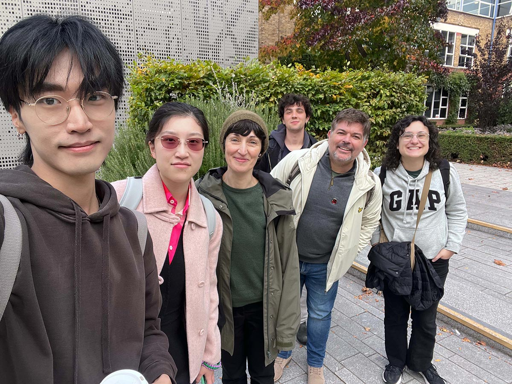
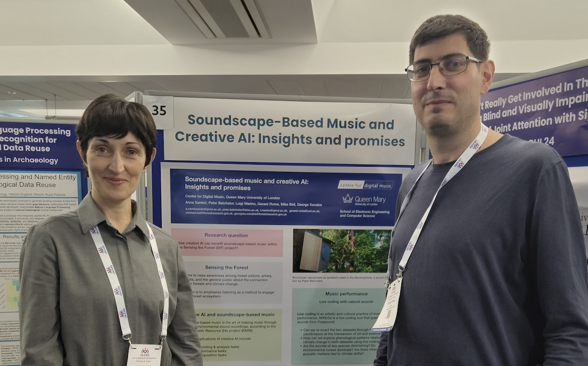

[[about]] | [[publications]] | [[people]] 

*From left to right: Shuoyang Zheng, Lianganzi Wang, Anna Xambó Sedó, Nico García-Peguinho, Merlin Goldman and Jimena Arruti. Photo by Shuoyang Zheng.*
## Latest News

|                                                                                    |                                                                                                                                                                                                                                                                                                                                                                                                                                                                                                               |
| ---------------------------------------------------------------------------------- | ------------------------------------------------------------------------------------------------------------------------------------------------------------------------------------------------------------------------------------------------------------------------------------------------------------------------------------------------------------------------------------------------------------------------------------------------------------------------------------------------------------- |
|                                         | [[Dr Anna Xambó presents at the Freesound Day programme]] Anna will be presenting "Sensing the Forest: Exploring Climate Change Through Soundscape Datasets from DIY Streamers at Alice Holt Forest" at the [Freesound Day programme, October 28th, Barcelona and online](https://blog.freesound.org/?p=2290)                                                                                                                                                                                                 |
|                                         | [[Qiaoxi Zhang presents at TENOR 2025]] Qiaoxi will be presenting the following paper at the [TENOR 2025](https://zhuanti.ccom.edu.cn/tenorbjen/index.htm) conference (October 25-27, 2025): Zhang, Q., Barthet, M., Xambó Sedó, A. “From Shape to Music: Contour-Conditioned Symbolic Music Generation”.                                                                                                                                                                                                    |
|  | [[Dr Gerard Roma and Dr Anna Xambó present a poster at UKAIRS 2025]] Gerard and Anna presented the Sensing the Forest project with the poster: Xambó, Anna; Batchelor, Peter; Marino, Luigi; Roma, Gerard; Bell, Mike; and Xenakis, George (2025). [Soundscape-based music and creative AI: Insights and promises](https://qmro.qmul.ac.uk/xmlui/bitstream/handle/123456789/110219/Xambo%20Soundscape-based%20music%202025%20Accepted.pdf?sequence=2), UK AI Research Symposium (UKAIRS) 2025, Newcastle, UK. |
