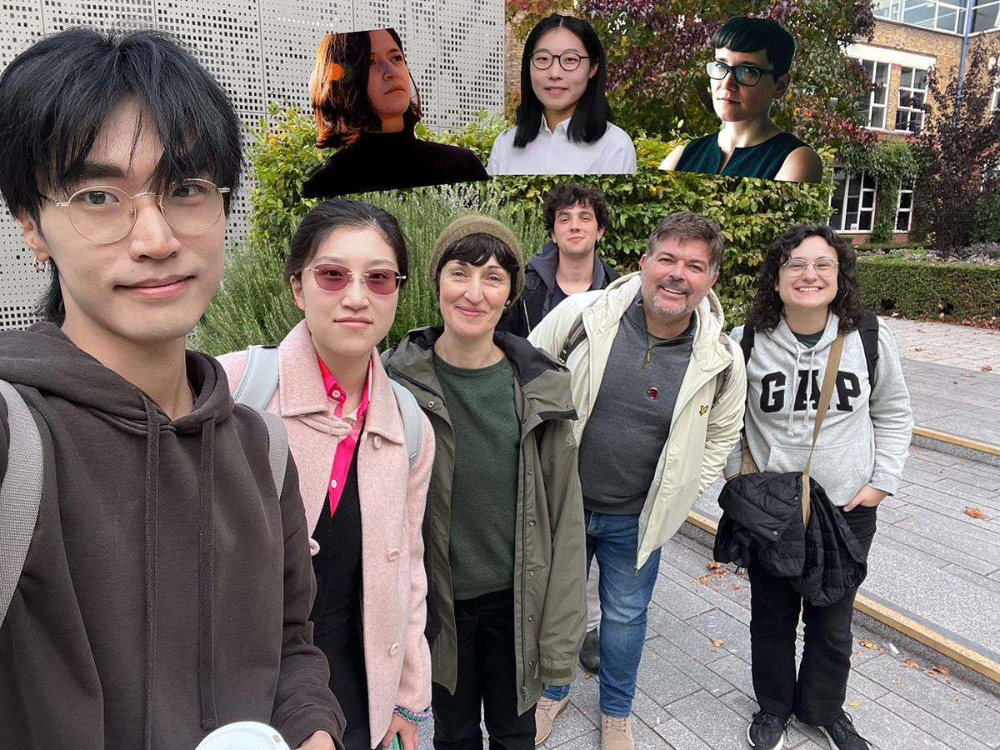

[[about]] | [[publications]] | [[people]] 

*From left to right: Shuoyang Zheng, Lianganzi Wang, Anna Xambó Sedó, Nico García-Peguinho, Merlin Goldman and Jimena Arruti. Top, from left to right: Lina Bautista, Qiaoxi Zhang and Solomiya Moroz. Photo and photo composition by Shuoyang Zheng.*
## Latest News

|                                         |                                                                                                                                                                                                                                                                                                                                                                                                |
| --------------------------------------- | ---------------------------------------------------------------------------------------------------------------------------------------------------------------------------------------------------------------------------------------------------------------------------------------------------------------------------------------------------------------------------------------------- |
|  | [[Exciting PhD Studentship Open in Our Lab Funded by China Scholarship Council]] We are happy to announce an exciting PhD position to work on **“Sonification techniques for understanding hidden processes of LLMs”** at the Centre for Digital Music, School of Electronic Engineering and Computer Science, Queen Mary University of London, funded by the China Scholarship Council (CSC). |
|                   | [[Dr Anna Xambó presents at the Freesound Day programme]] Anna will be presenting "Sensing the Forest: Exploring Climate Change Through Soundscape Datasets from DIY Streamers at Alice Holt Forest" at the [Freesound Day programme, October 28th, Barcelona and online](https://blog.freesound.org/?p=2290)                                                                                  |
|                   | [[Qiaoxi Zhang presents at TENOR 2025]] Qiaoxi will be presenting the following paper at the [TENOR 2025](https://zhuanti.ccom.edu.cn/tenorbjen/index.htm) conference (October 25-27, 2025): Zhang, Q., Barthet, M., Xambó Sedó, A. “From Shape to Music: Contour-Conditioned Symbolic Music Generation”.                                                                                     |
|                                         |                                                                                                                                                                                                                                                                                                                                                                                                |
