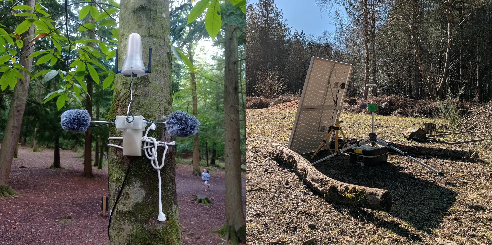

[[about]] | [[publications]] | [[people]] 

*From left to right: Shuoyang Zheng, Lianganzi Wang, Anna Xambó Sedó, Nico García-Peguinho, Merlin Goldman and Jimena Arruti. Top, from left to right: Lina Bautista, Qiaoxi Zhang and Solomiya Moroz. Photo and photo composition by Shuoyang Zheng.*
## Latest News

|                                         |                                                                                                                                                                                                                                                                                                                                                                                                |
| --------------------------------------- | ---------------------------------------------------------------------------------------------------------------------------------------------------------------------------------------------------------------------------------------------------------------------------------------------------------------------------------------------------------------------------------------------- |
|                   | [[PhD Opportunity - QMUL S and E Underrepresented Group Studentships]] We are seeking prospective PhD applicants for a project on human–human and human–robot live coding performance and musical co‑creation via haptic communication. We are especially interested to see how this can be realised through motion features and haptic input.   
 |                   | [[Nicolás António García-Peguinho and Lianganzi Wang at DMRN+20]] On Tuesday 16th December 2025, Nicolás António García-Peguinho and Lianganzi Wang presented their initial work related to their PhDs at the Digital Music Research Network One-day Workshop 2025.
|  | [[Exciting PhD Studentship Open in Our Lab Funded by China Scholarship Council]] We are happy to announce an exciting PhD position to work on **“Sonification techniques for understanding hidden processes of LLMs”** at the Centre for Digital Music, School of Electronic Engineering and Computer Science, Queen Mary University of London, funded by the China Scholarship Council (CSC). |
|                   | [[Tug OFlaherty and Dr Anna Xambó - Paper and performance at WAC 2025]] Tug and Anna presented a paper and performance related to the Sensing the Forest project at the [Web Audio Conference, 19-21 November, Paris, France](https://wac-2025.ircam.fr)
|                  | [[Shuoyang Zheng - Exploring Gestural Affordances in Audio Latent Space Navigation]] Our journal article "Exploring Gestural Affordances in Audio Latent Space Navigation" has just been published in Frontiers in Computer Science as part of the "Embodied Perspectives on Sound and Music AI" research topic! The journal article is led by PhD student Shuoyang Zheng and is co-authored with Dr Anna Xambó Sedó and Prof Nick Bryan-Kinns.   
|                   | [[Dr Anna Xambó presents at the Freesound Day programme]] Anna will be presenting "Sensing the Forest: Exploring Climate Change Through Soundscape Datasets from DIY Streamers at Alice Holt Forest" at the [Freesound Day programme, October 28th, Barcelona and online](https://blog.freesound.org/?p=2290)                                                                                  |
|                   | [[Qiaoxi Zhang presents at TENOR 2025]] Qiaoxi will be presenting the following paper at the [TENOR 2025](https://zhuanti.ccom.edu.cn/tenorbjen/index.htm) conference (October 25-27, 2025): Zhang, Q., Barthet, M., Xambó Sedó, A. “From Shape to Music: Contour-Conditioned Symbolic Music Generation”.                                                                                     |
|                                         |                                                                                                                                                                                                                                                                                                                                                                                                |

